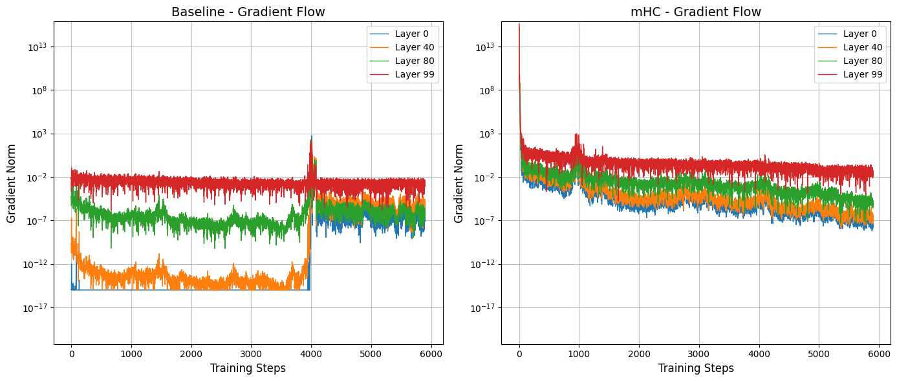
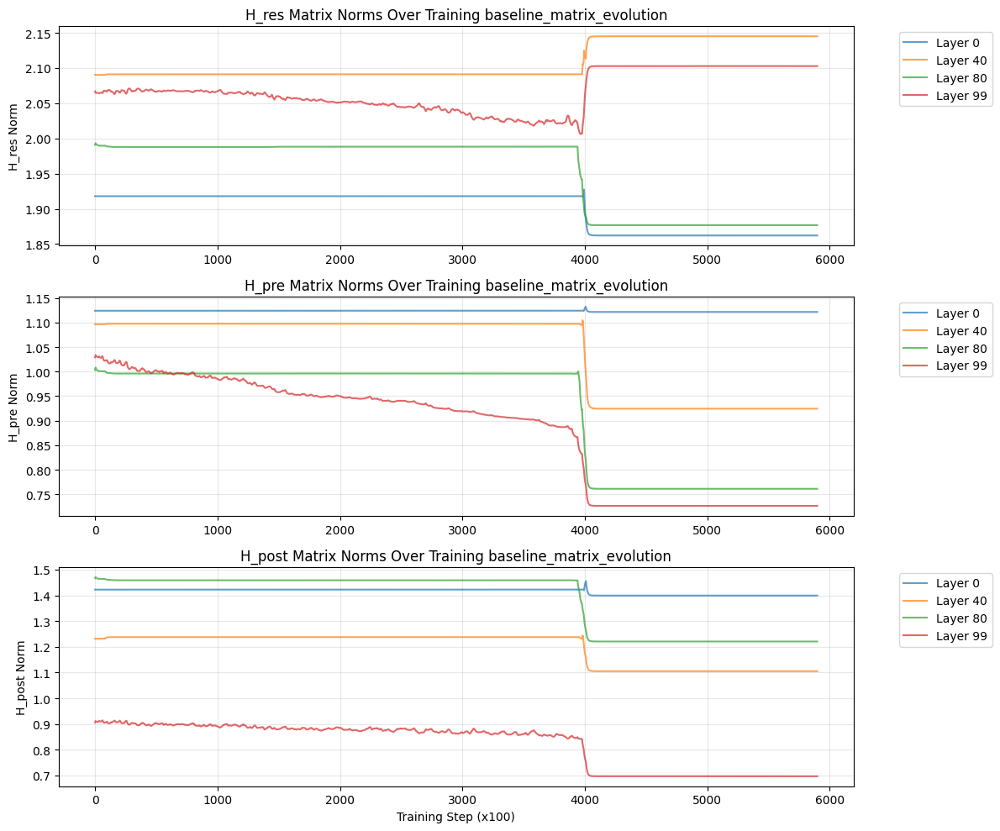

# mHC: Manifold-Constrained Hyper-Connections - Implementation & Validation

A PyTorch implementation and empirical validation of DeepSeek's mHC architecture, demonstrating how mathematical constraints on routing matrices prevent catastrophic gradient collapse in deep neural networks.

Explained mHC in [medium](https://medium.com/@apurv.pujari1/advanced-residual-connection-mhc-manifold-constrained-hyper-connections-b9455f35f08e)
Explained results in [medium](https://medium.com/@apurv.pujari1/implementing-and-validating-mhc-a-deep-dive-into-manifold-constrained-hyper-connections-56feb86be8f8?postPublishedType=initial)
## What This Repository Contains

- Clean PyTorch implementation of mHC layer with Sinkhorn-Knopp algorithm
- Training pipeline comparing baseline vs mHC on BoolQ reasoning task
- Visualization tools for gradient flow and matrix norm evolution
- 100-layer models (~28.8M parameters each) proving mHC's stability claims

## Key Findings

**Trained two 100-layer networks (28.8M params) and discovered:**

### Gradient Flow
- **mHC**: Maintains 10⁻² to 10⁻⁷ gradient range across all 100 layers throughout training
- **Baseline**: Suffers gradient vanishing to 10⁻¹⁷ in deep layers, 10¹⁵× gradient ratio between shallow/deep layers

### Training Stability  
- **mHC**: Rock-solid matrix norms (H_res ≈ 1.9) throughout 6,000 training steps
- **Baseline**: Catastrophic collapse at step ~3,800 with gradient explosion (10³×) followed by unstable equilibrium

### The Critical Difference
At step 3,800, baseline's unconstrained routing matrices drift into unstable configuration → signal amplification/attenuation → gradient explosion → training dynamics fundamentally change. mHC's doubly stochastic constraint prevents this drift entirely.

## Why This Matters for LLMs

**If a 28.8M parameter, 100-layer model shows 10¹⁵× gradient stratification, what happens with billion-parameter LLMs (60-100+ layers)?**

- Gradient vanishing exponentially worse
- Deep layers effectively frozen (can't learn)
- Training instability occurs earlier and more severely
- Requires extensive hacks (gradient clipping, careful initialization, warmup schedules)

**mHC offers a principled architectural solution** instead of hyperparameter band-aids.

## Experimental Results

### Gradient Flow Comparison (100 Layers, 6000 Steps)

  

**Left (Baseline)**: Catastrophic gradient vanishing (10⁻¹⁷) with explosion at step ~3,800  
**Right (mHC)**: Stable gradients (10⁻² to 10⁻⁷) throughout training

---

### Matrix Norm Evolution

#### Baseline: Catastrophic Breakdown ❌

  

- Stable until step ~3,800
- Sudden collapse at step 3,800-4,000
- Training dynamics fundamentally change

#### mHC: Rock-Solid Stability ✅

  

- H_res norms: Perfectly flat at ~1.9 across all layers
- No drift, no explosion, no vanishing

---

### Architecture Diagram

  

---

### Implementation

📓 **Jupyter Notebook**: [mHC_implementation_git.ipynb](mHC_implementation_git.ipynb)

Complete implementation with training loop, visualization, and analysis.

## Results Summary

| Metric | Baseline (100L) | mHC (100L) |
|--------|-----------------|------------|
| **Gradient range** | 10⁻¹⁷ to 10⁻² | 10⁻⁷ to 10⁻² |
| **Gradient ratio (L99/L0)** | ~10¹⁵× | ~100× |
| **Matrix norm stability** | ❌ Collapses at step 3,800 | ✅ Stable throughout |
| **Training stability** | ❌ Catastrophic failure | ✅ No instability |
| **Deep layer learning** | ❌ Frozen (10⁻¹⁷ gradients) | ✅ Active (10⁻⁷ gradients) |

## Implementation Details

- **Architecture**: 100-layer networks, hidden_dim=512
- **Dataset**: BoolQ (yes/no reasoning questions)
- **Training**: 6,000 steps, batch_size=32
- **Constraint**: Doubly stochastic matrices via Sinkhorn-Knopp (20 iterations)
- **Hardware**: Google Colab T4 GPU (~2 hours per model)

## Key Takeaway

**In deep learning, architectural constraints aren't limitations—they're design principles.** mHC proves that the right mathematical structure (doubly stochastic matrices) is the difference between a trainable 100-layer model and a gradient graveyard.

The 10¹⁵× difference in gradient flow is not subtle—it's the difference between a model that can learn from all its layers and one that's effectively shallow despite architectural depth.

## Paper Reference

[mHC: Manifold-Constrained Hyper-Connections](https://arxiv.org/abs/2512.24880](https://arxiv.org/abs/2512.24880 ) - DeepSeek-AI, 2025

*Sometimes the best insights come from the simplest experiments. This implementation prioritizes educational clarity over production optimization.*
